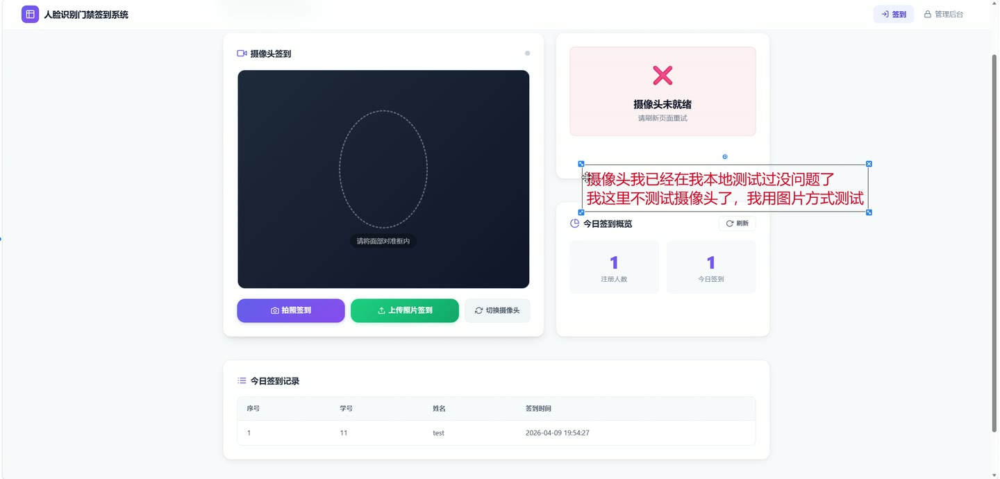
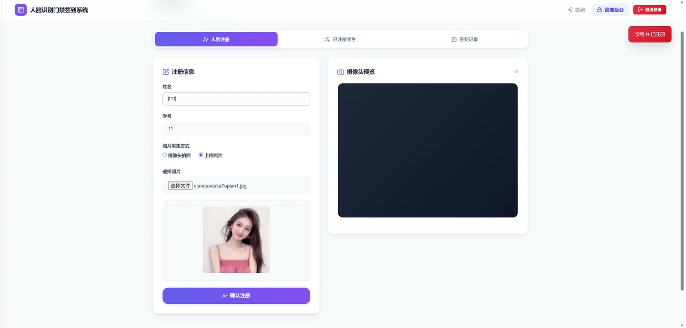
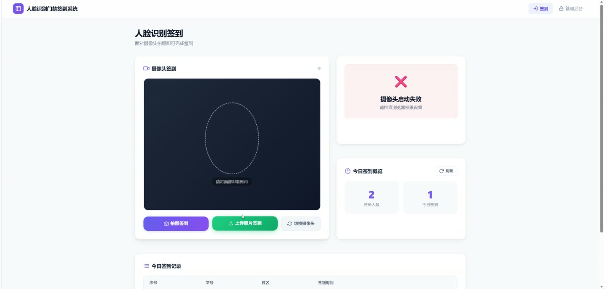
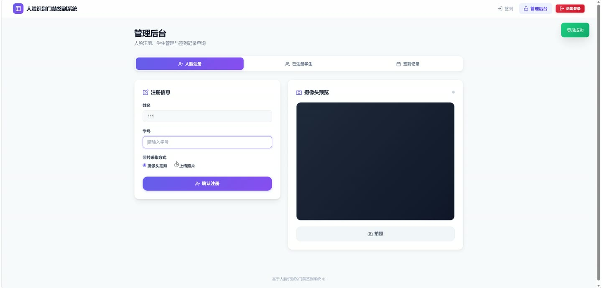
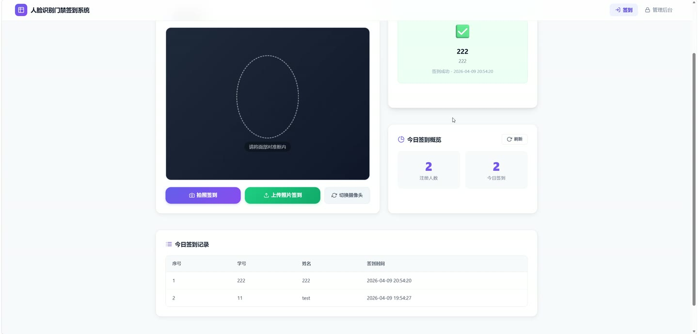

# (附文档)Python 基于人脸识别的门禁签到系统

**技术栈**：Python、Flask

### 系统简介

本系统是一套基于人脸识别的门禁签到平台，采用 Flask 单体架构与前后端页面结合的方式实现。系统内置学生人脸注册、1:N 人脸比对签到、签到记录查询与 Excel 导出等能力，并区分普通用户端与管理员端两类角色，管理员通过会话登录进入后台进行人员与记录管理。
 
### 核心功能
 
### 普通用户端

 
- 打开签到页面，调用摄像头拍照，将画面以 base64 形式提交至识别接口完成签到。 
- 提交照片后由后端进行人脸检测与 128 维特征提取，返回识别结果与签到状态。 
- 识别成功时页面展示姓名、学号、匹配距离与签到时间。 
- 重复签到时提示"今日已签到"，并返回当日已存在记录的标记与时间。 
- 未检测到人脸时返回"未检测到人脸"提示，引导重新拍摄。 
- 未匹配到已注册人员时返回"未识别到匹配人员，请先注册"提示。 
- 图像处理异常时返回"图像处理失败"提示，便于用户排查拍摄问题。 
- 无需登录即可访问签到页面，签到接口对外开放。
 
### 管理员端

 
- 使用用户名与密码登录后台，密码经 SHA-256 哈希后与数据库比对，登录成功后写入会话。 
- 会话有效期 2 小时，支持永久会话标记，未登录访问受保护接口返回 401 或跳转登录页。 
- 查询当前登录状态，返回是否已登录及当前管理员用户名。 
- 退出登录，清空当前会话信息。 
- 人脸注册：填写姓名、学号并上传照片，提交后检测人脸并提取特征向量入库。 
- 注册时校验姓名、学号、照片均不能为空，学号唯一，重复学号返回"已注册"提示。 
- 注册时若未检测到人脸返回提示，若检测到多张人脸提示"请确保画面中只有一人"。 
- 签到记录查询：按日期筛选记录，支持按学号模糊搜索，默认查询当天数据。 
- 记录分页展示，返回总条数、当前页码、每页条数与记录列表，按签到时间倒序排列。 
- 导出 Excel：按指定日期导出签到记录，包含序号、学号、姓名、签到时间四列。 
- 导出文件带表头样式、列宽设置与单元格边框，工作表以"签到记录_日期"命名。
 
### 技术栈

 后端框架Python + Flask RESTful 接口Flask-RESTful（Api，prefix=/api） 人脸识别face_recognition（HOG 检测 + 128 维特征编码） 图像处理Pillow（PIL）、NumPy 数据库SQLite（WAL 模式） 会话与鉴权Flask session + SHA-256 密码哈希 + 登录装饰器 Excel 导出openpyxl 前端页面Flask 模板渲染（index.html 签到页、admin.html 管理页）
 
### 交付内容

 
- 后端完整源码 
- 前端完整源码 
- 数据库初始化脚本 
- 万字文档

## 界面展示

---

## 获取完整源码 + 万字文档

本仓库为项目介绍页。**完整前后端源码、数据库初始化脚本、万字项目文档**，请加微信 `kangkangcode`，或访问 [codekk.top](http://codekk.top) 获取。

可作课程设计 / 毕业设计参考，支持远程部署调试。